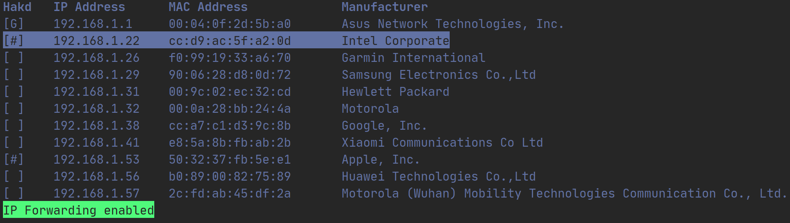

# ARPTool
ARPTool is my project for UAM's *Communication Networks II* course. It has two main programs, both written in Python 3.6+.

## Requirements

ARPTool works on Linux and macOS. It uses several third party libraries, which can be installed running pip:

```bash
pip install -r requirements.txt
```

## Attacker
It provides a nice CLI to see the devices on the LAN and perform ARP spoofing attacks on them.

```bash
sudo python attacker.py
```



To ARP spoof a device just select it using the arrows and press `Enter` or `Space`.  An asterisk indicates whether a device is being spoofed or not. IP Forwarding can be enabled or disabled pressing `Tab`. Spoofed devices won't have Internet access unless IP Forwarding is enabled. To quit, press `q` or `Control+C`.  [Click here](doc/attacker.md) for a more detailed explanation.

## Detector

This program will notify the user if an ARP spoofing attack is detected. To quit, just press `Control+C`. For a more thorough description [click here](doc/detector.md).

### Passive detector

It works detecting duplicates on the ARP cache (using ```ip neigh``` or  ```arp -a```). It's not the most effective detector because the victim might not have the attacker's MAC address on their ARP cache. It does not require root permission

```bash
python detector.py --passive
```

### Active detector

Every ARP *is-at* message received will be analyzed. For instance if "192.168.1.1 is at 00:11:22:33:44:55" is received, a "Who has 192.168.1.1?" message will be sent to the broadcast address. If we get a different MAC address than 00:11:22:33:44:55 an ARP spoofing attack is probably happening.

```bash
sudo python detector.py --active
```

### Notification frequency

By default, the detector won't show the same notification twice in less than 10 seconds, to avoid a notification flood. That threshold can be modified using the delay flag. Some examples are shown below.

```bash
python detector --passive --delay 60
```

```bash
sudo python detector --active --delay 30
```


