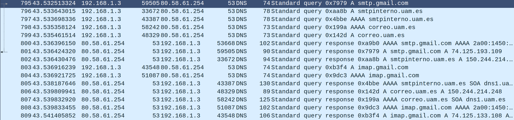
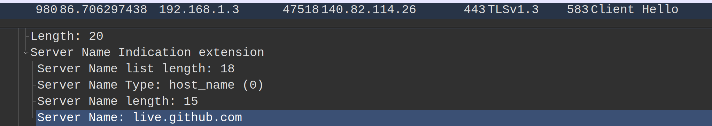

# Attacker

A lot of different tools perform ARP spoofing attacks, such as Bettercap (written in Golang) and zANTI (available for rooted Android devices). Nonetheless, I wanted to get a better grasp on this topic, and that's why I developed this program. 

## Interface

The interface has been created using the curses library, which is included by default in every Python installation.

## Discovery thread

A thread runs the function `scan_network` in the background looking for devices in the local network and printing the results. First of all, basic information about the default interface is gathered (such as the network submask and the gateway IP and MAC addresses). From then on, a "who-has" ARP message is sent periodically to every possible IP to discover new devices. Furthermore, the program will try to obtain the manufacturer of every discovered device using its MAC address and the `manufacturers.txt` file.

## Poisoner

When a device is selected (pressing `Enter` or `Space`), the poisoning starts. Initially, I had in mind the following two procedures:

* **Make the victim think we are the gateway.** This is done sending a "is-at" ARP message to the victim (that is, the destination IP and MAC are the victim's) saying that the gateway has our MAC address. For example, "192.168.1.1 is at 00:11:22:33:44:55", where 00:11:22:33:44:55 is our MAC address. This simple message will change the victim's ARP cache, and all the data that would normally go to the gateway will go through our machine instead. It is important to enable IP forwarding if we want the victim to keep on communicating with the Internet. If we don't, the victim will send us their traffic and we will drop it. Pressing `Tab` will toggle IP forwarding.
* **Make the gateway think we are the victim.** The idea is the same as before, but unfortunately this don't usually work. An ARP spoofing attack that combines these two procedures is called a duplex attack, but modern routers block it, so the code corresponding to this method is commented in `mitm.py`.

We should keep in mind that after the attack we should restore the victim's ARP cache. This is done by sending a "is-at" ARP message to the victim (just like before) with the real gateway MAC address. The actual implementation is done in the `Poisoner` class. This class stores the gateway and target's IP and MAC addresses, a thread (which will send a poisoning ARP message to the victim periodically) and an `Event` object. The `Event` object acts a sentinel, so the loop will keep on going until the `Event` is set. In addition, the sleep between loop iterations is not done using the `sleep` function but the sentinel's one. This makes possible to stop the thread almost immediately (note that if an ordinary variable had been used we would have to wait until the sleep had finished). Nobody should access the thread nor the `Event` object from the outside. Thus, they are private variables. This class has two methods: stop and stop_and_join. The first one will set the `Event`, and the second one will also wait until the thread has finished.

## MitM attacks

Once the attacker is in the middle, that is, all traffic from the victim is routed through the attacker, several attack vectors arise.

### DoS

If the attacker disables IP forwarding, all traffic from the victim to the outside world will be dropped, leaving the victim without connection.

### Credential sniffing

If the victim uses insecure protocols, such as Telnet, FTP or HTTP, where the credentials are sent in plain-text, the attacker will be able to retrieve them. Nowadays, however, most web traffic is sent over HTTPS, which is ciphered. Thus, sniffing plain-text passwords cannot be done that easily. 

#### SSLStrip

SSLStrip is a tool that mantains an HTTPS connection between the attacker and the server, and an HTTP one between the attacker and the victim. It only works if the victim visits an HTTP website that redirects to HTTPS.

### Watch activity

Even if traffic is cyphered, DNS messages are *usually* not (the reason for that *usually* is that companies such as Firefox are starting to deploy DNS over HTTPS (DoH)). The attacker can exploit this to see all the DNS requests of the victim, getting the websites they visit, the email provider they use...

Another way of getting the visited websites' names if they run over HTTPS is to see the Server Name Indication (SNI) field in the TLS handshake.

